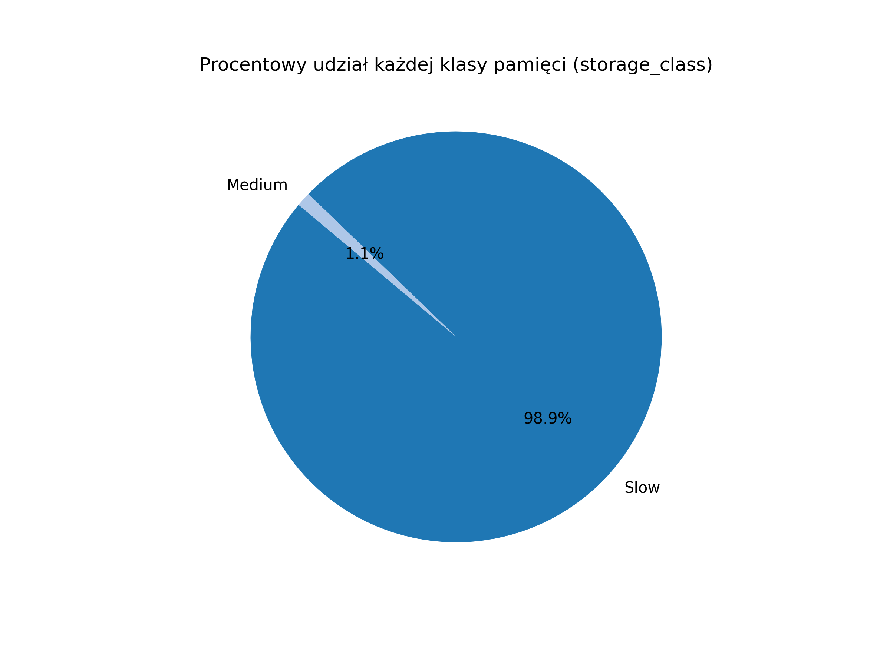
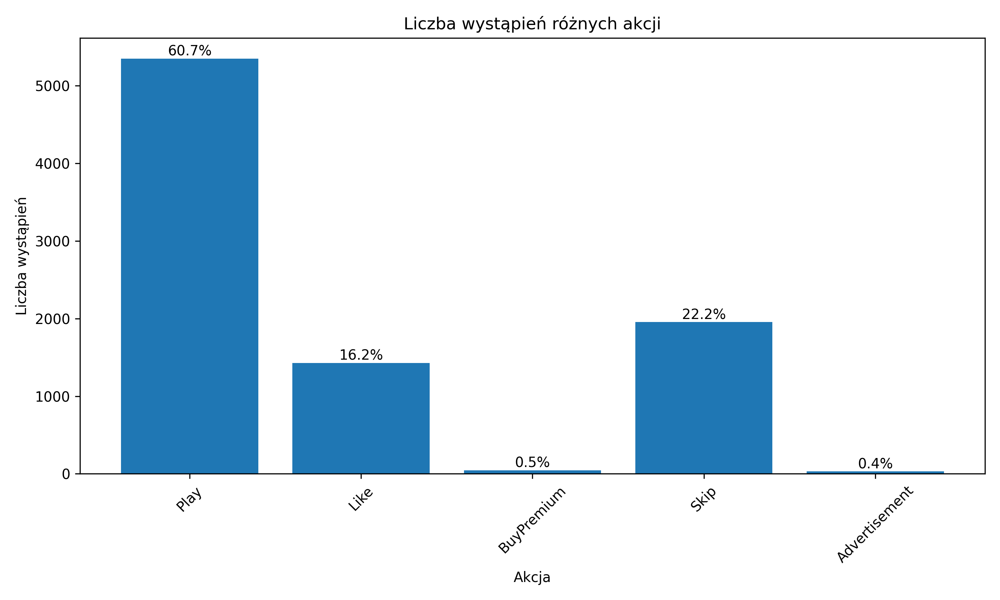
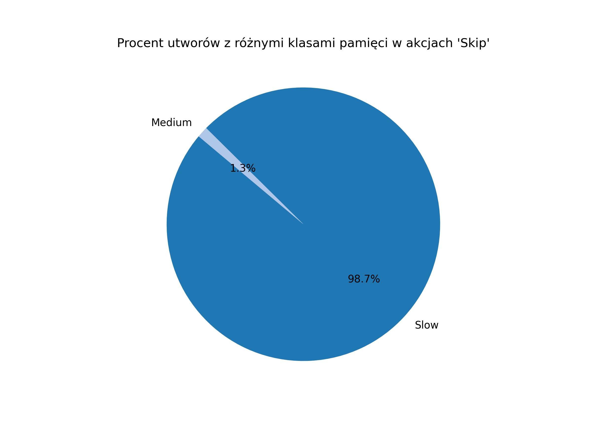
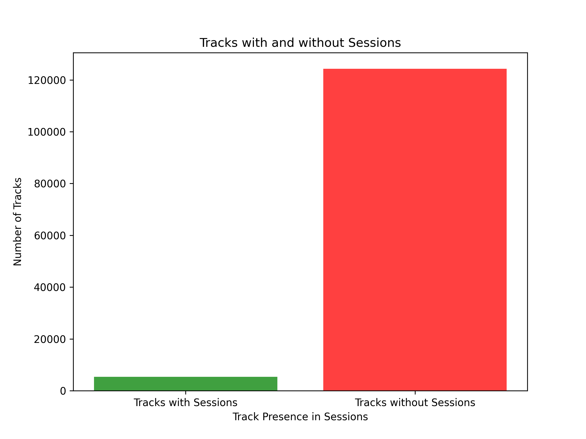
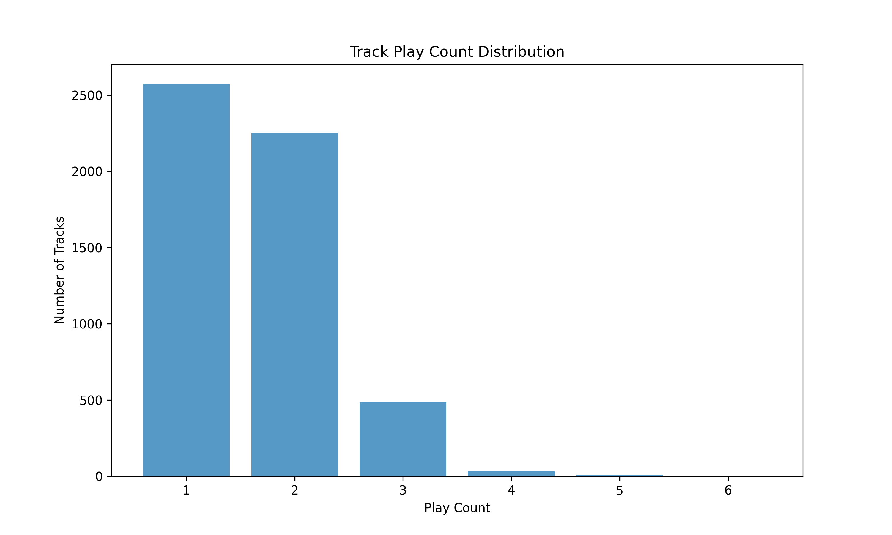
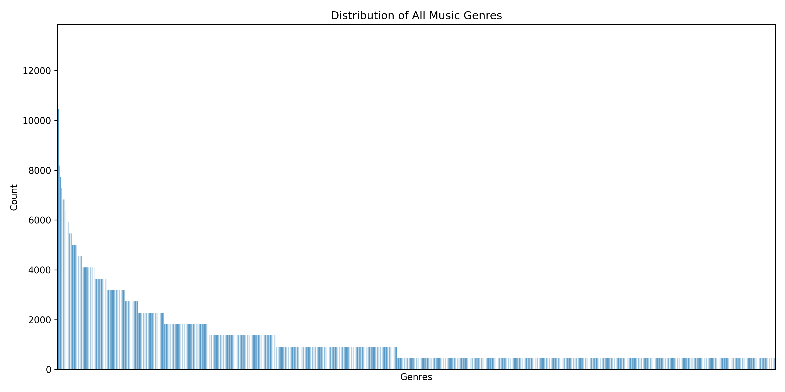

# IUM-Fijalkowski-Niewiarowski
Repository for realization of 2024Z IUM project

### Cytat tematu:
“Gdybyśmy tylko wiedzieli, kiedy użytkownik będzie chciał przesłuchać bieżący utwór w całości, a kiedy go przewinie – moglibyśmy lepiej zorganizować nasz cache”

# Analiza tematu
## Definicja problemu biznesowego
Stworzenie modelu klasyfikującego czy użytkownik nie pominie danego utworu. Przyda się to w celu stwierdzenia potrzeby cache-owania konkretnego utworu. Czyli jeśli dla danego utworu dany użytkownik będzie go najprawdopodobniej pomijał, nie ma potrzeby cache-owania go. W innym przypadku w celu usprawnienia działania aplikacji dla użytkownika możemy dany utwór cache-ować.

## Zdefiniowanie zadania modelowania
### Zadanie
Zajmujemy się klasyfikacją binarną akcji użytkowników. Staramy się określić czy dany użytkownik pominie lub nie pominie dany utwór na podstawie jego preferencji i atrybutów danego utworu.
### Założenia
- Użytkownicy mają w miarę stałe preferencje muzyczne (nie zmieniają ich co dwa tygodnie)
- Analitycy dostarczają poprawne i pełne dane
- Nie rozróżnimy typów pominięcia utworu w zależności od czasu przesłuchanego utworu, utwór pominięty w  1/2 lub w 1/4 jego trwania jest tak samo pominiętym utworem

## Model bazowy
### Opis
Jako model bazowy stworzyliśmy program który sprawdza czy typ danej piosenki jest wśród lubianych typów muzyki danego użytkownika i definiowaliśmy, że pominie ten utwór jeśli nie jest
### Wyniki
Tablica pomyłek dla modelu bazowego:
```
[  255  1386]
[  102 3876]
```
Inne metryki:
- Dokładność: 0.29
- Recall: 0.71
- Precyzja: 0.06


## Kryteria sukcesu
### Biznesowe
Celem jest przyspieszenie działania aplikacji poprzez cache-owanie tylko potrzebnych utworów, więc odpowiednim kryterium sukcesu będzie zbieranie metryk dotyczących na ile dokładne były nasze predykcje w środowisku produkcyjnym. Pozwoli to określić czy nasz model w realny sposób usprawnia działanie aplikacji. Ze względu na specyfikę zadania można zbierać te metryki w czasie rzeczywistym po czym prezentować je w zintegrowanych systemach (użyć w tym celu można np. prometeusza i grafany).
### Analityczna
Model bazowy ma bardzo niską dokładność 29%, naszym zadniem będzie utworzenie modelu o większej dokładności

## Analiza danych
Klient udostępnił nam dane dotyczące:

- lista dostępnych artystów i utworów muzycznych,
- baza użytkowników,
- historia sesji użytkowników,
- techniczne informacje dot. poziomu cache dla poszczególnych utworów.

Z analizy dostarczonej wersji danych wyciągneliśmy następujące wnioski:

- Otrzymaliśmy dane tylko 50 użytkowników, pola opisujące użytkownika nie są podpisane co utrudnia zrozumienie struktury danych opisującej użytkownika serwisu pozytywka. Dodatkowo dane części użytkowników są nie kompletne, w 3 przypadkach brakuje ID użytkownika, a dla innych 3 nie została podana wartość pola opisywanego wartością binarną true/false
- W przypadku danych o utworach dostępnych w serwsie pozytywka otrzymaliśmy informację o około ~130 000 utworów, dane są w przeważającej części kompletne poza jedną kolumną (mode), w przypadku tej kolumny w 80% (103718) rekordów jej wartość jest pusta.
- Plik trac_storage zawiera informacje o przechowywaniu poszczególnych utworów w cache, informacja o klasie pamięci w jakiej jest przechowywany oraz koszt obsługi każdego utworu. W dostarczonych danych można zauważyć bardzo małą ilość utworów dla których storage_mode jest inna niż 'Slow'. Dla poszczególnych wartości liczby rekordów prezentują się w następujący sposób:

    Liczba wystąpień dla każdej klasy pamięci:
    - Slow: 128182
    - Medium: 1459
    - Fast: 7

    Procentowy rozkład został zaprezentowany na poniższym wykresie:



- W pliku sessions otrzymaliśmy informację o około ~10 000 sesjach użytkownika, w przypadku 1301 wierszy posiadało puste wartości. Dodatkowo pola opisujące sesje nie zostały podpsiane, przez co trudno zrozumieć znaczenie biznesowe części pól, w szczególności ostatniej kolumny, będącej dla każdego przypadku liczbą natrualną, dodatnią. Rozkład pola nr. 4 które interpretujemy jako akcję podjętą w danej sesji wygląda w następujący sposób:



- Dodatkowo wygenerowaliśmy wykresy ukazujące klasę pamięci dla akcji 'Skip' oraz 'Play', jednak nie staraliśmy się wyciągać jakichkolowiek przypuszczeń bądź wniosków ze względu na duży udział klasy 'Slow' w udostępnionych danych.




Liczba dostępnych danych na temat sesji jest niewielka w porównaniu do ilości danych na temat utworów
Ukazują to dwa sporządzone wykresy, na pierwszym z nich widzimy ilość utworów które wystąpują co najmniej raz w pliku sessions, oraz ilość utworów których id nie występuje w pliku sessions:



W zapisie z ~9200 sesji występuje około 5300 utworów co stanowi około 4% spośród wszystkich udostępnionych nam utworów.

Drugi wykres ukazuje ilość wystąpień uworów w pliku sessions:



Unikalne utwory pojawiały się najczęściej 1-2 razy w pliku sessions, najczęściej występujący utwór pojawił się pliku sessions 5 razy

- W pliku artists otrzymaliśmy dane na temat 27650 artystów. Dla ~2600 wierszy dane są niekompletne, występuje to dla pierwszej oraz ostatniej kolumny. Dodatkowo brakuje nazw poszczególnych kolumn.

Dodatkowo sprawdziliśmy jaki rodzaj muzyki występuje w dostarczonych danych nt. sesji użytkownika, rodzaj muzyki ustalaliśmy na bazie podaych gatunków muzycznych dla artystów przypisanych do konkretnych utworów. Wykres prezentuje się w następujący sposób:



Na wykresie możemy zauważyć istotną różnicę w występowaniu poszczególnych gatunków muzycznych w dostarczonych danych na temat sesji użytkowników, część z gatunków muzycznych jest częściej proponowana przez aplikację.

### Wnioski wyciągnięte na podstawie przeprowadzonej analizy

- Nieproporcjonalna liczba sesji użytkownika w stosunku do liczy utoworów:
    - Otrzymano dane dla ~130 000 utworów, ale tylko ~10 000 sesji użytkowników. Z tych sesji jedynie 5 300 unikalnych utworów jest odnotowanych, 96% utowrów nie zostało nigdy odnotowanych w sejsach użytkowników.
    - Większość unikalnych utworów w sesjach pojawiła się tylko 1–2 razy, a najczęściej występujący utwór pojawił się maksymalnie 5 razy. Oznacza to ograniczoną ilość danych treningowych dla modelu dotyczącego popularności utworów.
    - Ograniczona liczba sesji w stosunku do liczby utworów powoduje nierównomierne reprezentowanie danych w modelu, co może skutkować w przyszłości niską dokładnością predykcji dla rzadziej występujących utworów.
- Nadreprezentacja klasy pamięci "Slow":
    - W pliku "trac_storage" zdecydowana większość utworów (98.9%) znajduje się w klasie pamięci "Slow". Inne klasy, takie jak "Medium" i "Fast", są marginalnie reprezentowane, co ogranicza różnorodność danych do analizy.
- Mała ilość danych na temat użytkowników:
    - W pliku Users znajdują się informacje na temat tylko 50 użytkowników
- Brak opisu dostarczonych danych:
    - Niejasne zrozumienie niektórych pól utrudnia efektyną analizę dostarczonych danych
    - Przed kolejną iteracją etapu analizy danych konieczna będzie konsultacja z klientem, w celu ustalenia znaczenia biznesowego części dostarczonych danych.