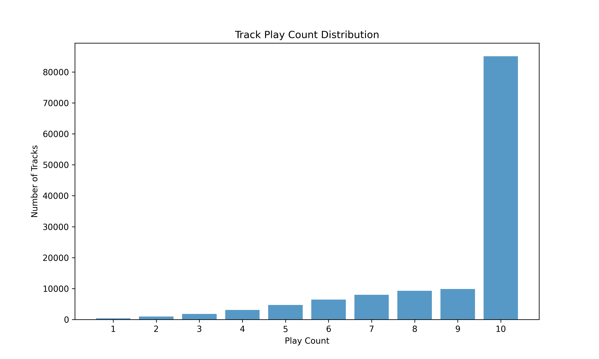

# IUM-Fijalkowski-Niewiarowski
Repository for realization of 2024Z IUM project

### Cytat tematu:
“Gdybyśmy tylko wiedzieli, kiedy użytkownik będzie chciał przesłuchać bieżący utwór w całości, a kiedy go przewinie – moglibyśmy lepiej zorganizować nasz cache”

# Analiza tematu
## Definicja problemu biznesowego
Stworzenie modelu klasyfikującego czy użytkownik nie pominie danego utworu. Przyda się to w celu stwierdzenia potrzeby cache-owania konkretnego utworu. Czyli jeśli dla danego utworu dany użytkownik będzie go najprawdopodobniej pomijał, nie ma potrzeby cache-owania go. W innym przypadku w celu usprawnienia działania aplikacji dla użytkownika możemy dany utwór cache-ować.

## Zdefiniowanie zadania modelowania
### Zadanie
Zajmujemy się klasyfikacją binarną akcji użytkowników. Staramy się określić czy dany użytkownik pominie lub nie pominie dany utwór na podstawie jego preferencji i atrybutów danego utworu.
### Założenia
- Użytkownicy mają w miarę stałe preferencje muzyczne (nie zmieniają ich co dwa tygodnie)
- Analitycy dostarczają poprawne i pełne dane
- Nie rozróżnimy typów pominięcia utworu w zależności od czasu przesłuchanego utworu, utwór pominięty w  1/2 lub w 1/4 jego trwania jest tak samo pominiętym utworem

## Model bazowy
### Opis
Jako model bazowy stworzyliśmy program który sprawdza czy typ danej piosenki jest wśród lubianych typów muzyki danego użytkownika i definiowaliśmy, że pominie ten utwór jeśli nie jest
### Wyniki
Tablica pomyłek dla modelu bazowego:
```
[  255  1386]
[  102 3876]
```
Inne metryki:
- Dokładność: 0.29
- Recall: 0.71
- Precyzja: 0.06


## Kryteria sukcesu
### Biznesowe
Celem jest przyspieszenie działania aplikacji poprzez cache-owanie tylko potrzebnych utworów, więc odpowiednim kryterium sukcesu będzie zbieranie metryk dotyczących na ile dokładne były nasze predykcje w środowisku produkcyjnym. Pozwoli to określić czy nasz model w realny sposób usprawnia działanie aplikacji. Ze względu na specyfikę zadania można zbierać te metryki w czasie rzeczywistym po czym prezentować je w zintegrowanych systemach (użyć w tym celu można np. prometeusza i grafany).
### Analityczna
Model bazowy ma bardzo niską dokładność 29%, naszym zadniem będzie utworzenie modelu o większej dokładności

## Analiza danych
Klient udostępnił nam dane dotyczące:

- lista dostępnych artystów i utworów muzycznych,
- baza użytkowników,
- historia sesji użytkowników,
- techniczne informacje dot. poziomu cache dla poszczególnych utworów.

Z analizy dostarczonej nowej wersji danych wyciągneliśmy następujące wnioski:

- W drugiej wersji danych, otrzymaliśmy dane 5000 użytkowników, co stanowi duży wzrost względem pierwszej wersji danych kiedy to mieliśmy dane tylko 50 użytkowników. pola opisujące użytkownika są w czytelny sposób opisane. Dodatkowo dane dot. użytkowników są kompletne.
- W przypadku danych o utworach dostępnych w serwsie pozytywka otrzymaliśmy informację o około ~130 000 utworów, dane są w przeważającej części kompletne poza jedną kolumną (mode), w przypadku tej kolumny w 80% (103718) rekordów jej wartość jest pusta.
- Plik trac_storage zawiera informacje o przechowywaniu poszczególnych utworów w cache, informacja o klasie pamięci w jakiej jest przechowywany oraz koszt obsługi każdego utworu. W dostarczonych danych można zauważyć bardzo małą ilość utworów dla których storage_mode jest inna niż 'Slow'. Dla poszczególnych wartości liczby rekordów prezentują się w następujący sposób:

    Liczba wystąpień dla każdej klasy pamięci:
    - Slow: 128182
    - Medium: 1459
    - Fast: 7

    Procentowy rozkład został zaprezentowany na poniższym wykresie:


- W pliku sessions otrzymaliśmy informację o około ~4.7*10^6 akcjach podjętch przez użytkowników dla wersji danych v1, wszytskie rekordy są kompletne. Z struktury danych możemy wnioskować że rekordy opisują akcje podejmowane przez użytkownika, użytkownik zazwyczaj w czasie sesji odtwarza kilka utworów, każdy z tych utworów może być odwtworzony w całości, polubiony bądź pominięty na wybranym etapie odtwarzania. Pola opisujące sesje w przeciwieństwie do pierwszej wersji danych zostały czytelnie opisane, co ułatwiło zrozumienie struktury danych opisujących sesje. W ramach dostarczonych danych udostępnione zostały informacje o ~140 000 unikalnych sesjach.


- Dodatkowo wygenerowaliśmy wykresy ukazujące klasę pamięci dla akcji 'Skip' oraz 'Play', jednak nie staraliśmy się wyciągać jakichkolowiek przypuszczeń bądź wniosków ze względu na duży udział klasy 'Slow' w udostępnionych danych.


Liczba dostępnych danych na temat sesji wzrosła w porównianiu do pierwszej wersji danych.
Ukazują to dwa sporządzone wykresy, na pierwszym z nich widzimy ilość utworów które wystąpują co najmniej raz w pliku sessions w pierwszej wersji danych, widać że większość utworów, nie było ujętych w zapisach sesji. W później dostarczonych danych, przeważająca część utorów była ujęta w pliku sessions.


Kolejny wykres ukazuje ilość wystąpień uworów w pliku sessions:




Porównując oba wykresy, również można zauważyć iż druga wersja danych była o wiele bardziej reprezentatywna.

W drugiej wersji danych, unikalne utwory pojawiały się najczęściej po 10 lub więcej razy w pliku sessions, w przeciwieństwie do 1 wersji danych gdzie najczęściej utwory występowały 1 lub 2 krotnie.

- W pliku artists otrzymaliśmy dane na temat 27650 artystów. Dla wszystkich wierszy dane są kompletne, występuje to dla pierwszej oraz ostatniej kolumny.

Dodatkowo sprawdziliśmy jaki rodzaj muzyki występuje w dostarczonych danych nt. sesji użytkownika, rodzaj muzyki ustalaliśmy na bazie podaych gatunków muzycznych dla artystów przypisanych do konkretnych utworów. Wykres prezentuje się w następujący sposób:


Na wykresie możemy zauważyć istotną różnicę w występowaniu poszczególnych gatunków muzycznych w dostarczonych danych na temat sesji użytkowników, część z gatunków muzycznych jest częściej proponowana przez aplikację.

### Wnioski wyciągnięte na podstawie przeprowadzonej analizy

- Nieproporcjonalna liczba sesji użytkownika w stosunku do liczy utoworów:
    - Otrzymano dane dla ~130 000 utworów, oraz tylko ~4.7*10^6 akcji użytkowników. Informacje na temat akcji zawierały zapisy z odtwarzania większości utworów dostępnych w aplikacji.
    - Większość unikalnych utworów w sesjach pojawiła się 10 lub więcej razy. Oznacza to większą niż w 1 wersji danych ilość danych treningowych dla modelu dotyczącego popularności utworów, jednak ilość danych dot. sesji dalej mogłaby być większa, co zapewniłoby większą reprezentatywność.
    - Zwiększona liczba sesji może pomóc w opracowaniu lepszego modelu, oferującego wyższą jakość predykcji.
- Nadreprezentacja klasy pamięci "Slow":
    - W pliku "trac_storage" zdecydowana większość utworów (98.9%) znajduje się w klasie pamięci "Slow". Inne klasy, takie jak "Medium" i "Fast", są marginalnie reprezentowane, co ogranicza różnorodność danych do analizy.
- Większa ilość danych na temat użytkowników:
    - W pliku Users znajdują się informacje na temat tylko 5000 użytkowników, co stanowi o wiele większą grupę reprezentacyjną niż w przypadku 1 wersji danych.
- Czytelne opisy dostarczonych danych:
    - W porównaniu do 1 wersji danych, czytelne opisy ułatwiają biznesowe zrozumienie dostarczonych danych.